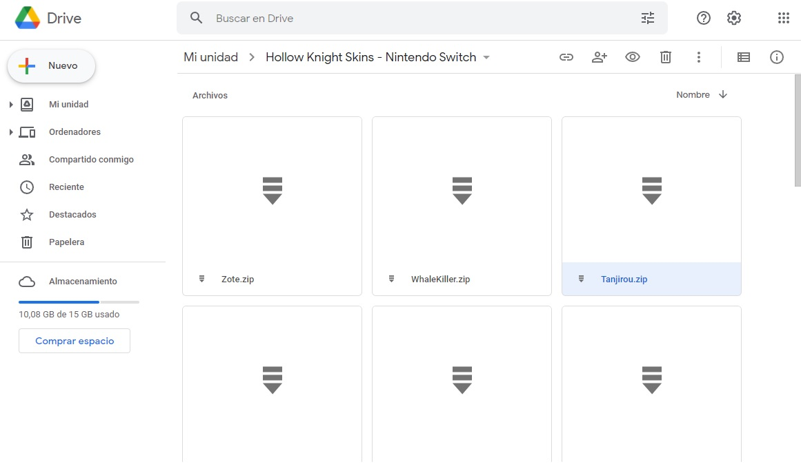
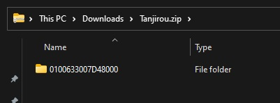
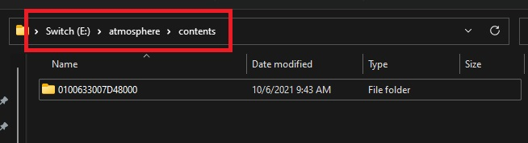
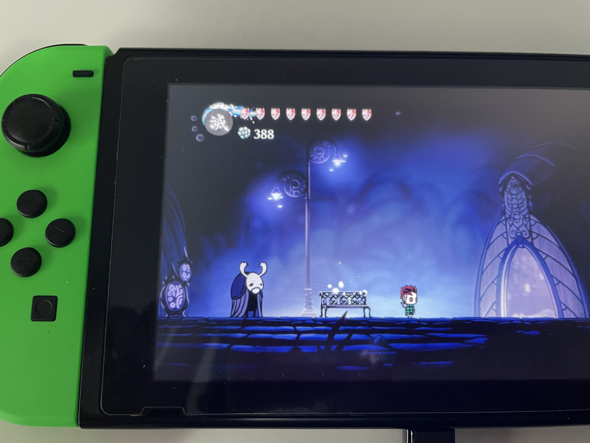

# Hollow Knight Skin to Nintendo Switch

[](https://drive.google.com/drive/folders/1DsV8DLH9cR9kU6-HRVgOhS99Pl6NXedr?usp=sharing)

This tool converts Hollow Knight Skins designed for PC to Nintendo Switch.

> To use a Hollow Knight skin in your switch you need 
[atmosphere](https://github.com/Atmosphere-NX/Atmosphere) installed.

## Disclaimer ⚠️

Atmosphere is required to install Hollow Knight Skins on your Nintendo Switch.

Atmosphere is a Custom Firmware (CFW) which means that you Nintendo Switch must be hacked (modded, etc. whatever you want to call it), but if you use a legit Hollow
Knight copy, you are still supporting team cherry, Nintendo and everyone involved
in the game. Therefore you are not breaking any law.

Install Amtmosphere at your own risk.

## Technical Details

Hollow Knight skins are converted so they work with the Atmosphere LayeredFS.
With LayeredFS you can replace romfs game files with your own. We take advantage of this and replace the original textures, which are located in the `.assets` files, with the ones of the skins. The assets files have a private binary format defined by the Unity team, therefore there is no straightforward way to modify these files without corrupting them. To modify these files we use the Python package `UnityPy`.The only "complex" part here is to find which assets file contains the texture we want to modify.

## Install a Custom Knight Skin

1. Navigate to this [drive folder](https://drive.google.com/drive/folders/1DsV8DLH9cR9kU6-HRVgOhS99Pl6NXedr?usp=sharing) and download the skin you prefer. For example the Tanjirou one.



2. Unzip the skin. Once unzipped you should see this folder:



3. Copy the `0100633007D48000` folder in your sd card inside the `atmosphere/contents`.



3. Restart your switch using atmosphere.


4. Launch the game and enjoy the skin!



Video tutorial: TBD (comming soon)

## Convert your PC skins to switch format

> This section is thought for people who are comfortable with the Switch scene. I don't recommend follow it if you are new to programming or switch "hacking".

### PC requirements

- Python 3 installed
- This repository downloaded

### Switch requirements

- Keys dumped with LockPick RCM.
- nxdump installed.

### Convert a custom skin

1. Dump a legit Hollow Knight copy with nxdump. Make sure you include the last update in the dump.

2. Get the resulting dump from the sd card (`/switch/nxdump/RomFs/0100633007D48800`) to your PC, for instance to your desktop.

3. Navigate to the folder containing the repository and run:

```
$ python hk-skin-nx.py \
    --dump-path /home/user/desktop/0100633007D48800 \
    --skin <path to pc skin> \
    --output out
```
4. If everything went as expected you are gonna find the skin under the out directory.

5. Finally to install the skin follow the guide above.

## TODOs

- [ ] Support for soul orb
- [ ] Support for charms

## Example pictures

TBD

## References

- [Custom Knight for PC](https://github.com/PrashantMohta/HollowKnight.CustomKnight)